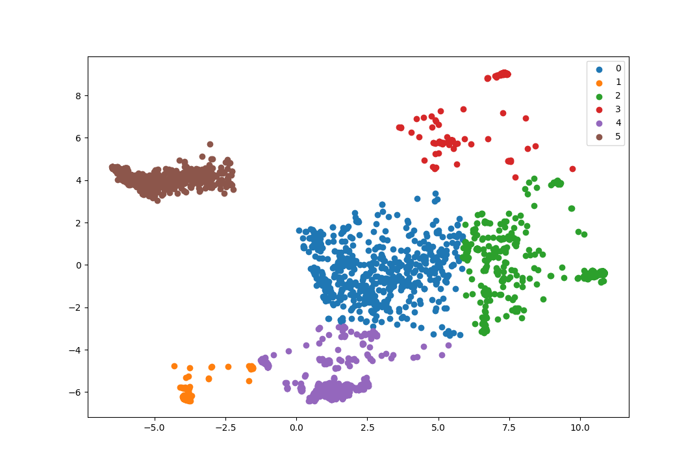

# CalMal: Malware-Behavior Clustering

    This project is to detect and classify malware behavior using machine learning.
    I assume that there's dataset as json files in "data/json" directory. 
    You can see/change it in config.ini file. 

# How to install
git clone https://your-repository-url.git
cd calmal
intall poetry 
    `poetry shell`
    `poetry install`
    `poetry run python app.py`

# Updating Dependency
`poetry update`

# Adding new dependency
`poetry install`

# Running Test
`poetry run pytest`

# Accessing Python Shell
`poetry run python`


# Overview

###  Requirements

- Install python and docker on your machine.

```
sudo apt install python3 pythone3-venv git
pip3 install -r requirements.txt
```


For web service running, run this script:
> poetry run python app.py

Then, you can open browser to test prediction by uploading json file;
```
localhost:1234
```

For training : 
Put all the JSON from VirusTotal to  /data/json then run 

`poetry run python data_process.py`

This will process the data and make it consumeable 

After that run :
`poetry run python data_encoder.py`
This will encode the baove data ot generate csv file.

After that run 

`poetry run python train.py`

For training the model.

Visualization Result:


###  Contribution guideline